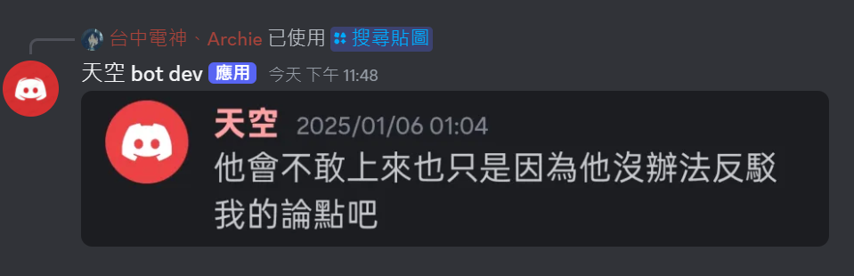

# sky-discord-bot v1

一個蒐集天空哥語錄並可以查詢並回應的DC機器人，沒什麼阮用。存屬好玩





## 伺服器邀請

```md
https://discord.com/oauth2/authorize?client_id=1349364533696663674&permissions=8&integration_type=0&scope=bot
```

將連接貼到瀏覽器並前往~~就可以邀請ㄌ

### 本機安裝

如果您是用`docker`部署，則不需要任何環境安裝。但我還沒包

如果是使用`node.js` 或 `bun.sh` 架設，應先照底下步驟

- 安裝依賴

```bash
bun install
```

- 如果為本機架設，需要以下環境變數

```env
DISCORD_DEV_TOKEN='you dc bot token'
```

- 執行

```bash
bun run src/index.ts
```

have a good day~

This project was created using `bun init` in bun v1.1.24. [Bun](https://bun.sh) is a fast all-in-one JavaScript runtime.
